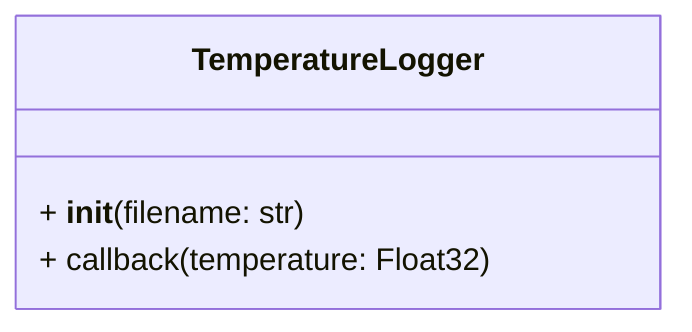

# Temperature logger

Our robot is mainly realized with a popular 3D printed material called PLA. This material softens at around 50° Celsius, and deformation can occur when a temperature higher than this lasts for a prolonged amount of time. 

To keep track of possible damages to the robot's chassis, we want to log every time our robot’s temperature reaches 50° Celsius in a text file containing the time of the event and the temperature detected. 

For this purpose a ROS2 package called `temperature_log` has been created, and is included in this repository. In particular, the main code for this package is inside `temperature_log/temperature_log/logger.py`. 

In that file a `TemperatureLogger` class should be implemented, with the following structure. Feel free to add methods and attributes if you need.

