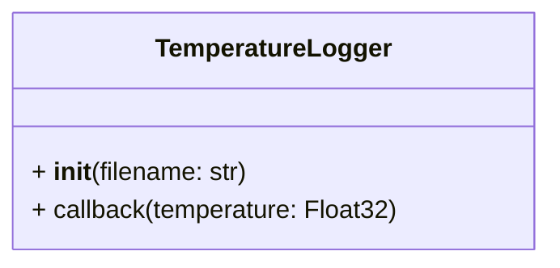

# Temperature logger

Our robot is mainly realized with a popular 3D printed material called PLA. This material softens at around 50° Celsius, and deformation can occur when a temperature higher than this lasts for a prolonged amount of time. 

To keep track of possible damages to the robot's chassis, we want to log every time our robot’s temperature reaches 50° Celsius in a text file containing the time of the event and the temperature detected. 

For this purpose a ROS2 package called `temperature_log` has been created, and is included in this repository. In particular, the main code for this package is inside `temperature_log/temperature_log/logger.py`. 

In that file a `TemperatureLogger` class should be implemented, with the following structure. Feel free to add methods and attributes if you need. You can also import any module from the Python Standard Library.



## ROS quick start 

While **you don't need to use ROS at all** to implement ant test the code you're asked to write, we still provide the basic steps to obtain a working ROS2 Humble environment in a **Ubuntu 22.04** environment. 

If you decide to try it, we suggest using WSL (if using Windows) or any other containerization/virtualization environment, to easily rollback any changes. 

### ROS install

The following is a summary of the instructions found in ROS2 documentation [here](https://docs.ros.org/en/humble/Installation/Ubuntu-Install-Debians.html).

```bash
# enable universe repository
sudo apt update
sudo apt install software-properties-common -y
sudo add-apt-repository universe

# add ROS2 repository key
sudo apt update
sudo apt install curl -y
sudo curl -sSL https://raw.githubusercontent.com/ros/rosdistro/master/ros.key -o /usr/share/keyrings/ros-archive-keyring.gpg

# add ROS2 repository
echo "deb [arch=$(dpkg --print-architecture) signed-by=/usr/share/keyrings/ros-archive-keyring.gpg] http://packages.ros.org/ros2/ubuntu $(. /etc/os-release && echo $UBUNTU_CODENAME) main" | sudo tee /etc/apt/sources.list.d/ros2.list > /dev/null

# install ROS2 and necessary packages
sudo apt update
sudo apt install ros-humble-ros-base ros-dev-tools python3-colcon-common-extensions -y

# setup environment for ROS2 development
source /opt/ros/humble/setup.bash
```

The last line should be executed every time you open a new bash shell. Alternatively, you can add it at the end of the `.bashrc` file in your user home.

### ROS workspace setup

Following are based upon [this tutorial by ROS](https://docs.ros.org/en/humble/Tutorials/Beginner-Client-Libraries/Colcon-Tutorial.html).

```bash
# create folder structure
mkdir -p ~/ros2_ws/src
cd ~/ros2_ws

# clone this repository in the src folder
git clone https://github.com/Team-Isaac-Polito/python_recruitment src/python_recruitment

# build the project
colcon build

# setup the environment for this project
source /opt/ros/humble/setup.bash
```

